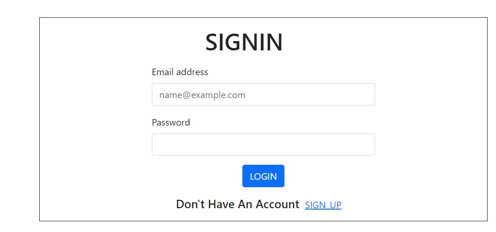
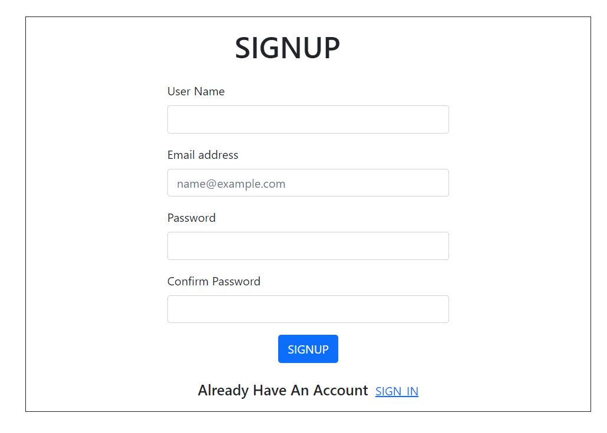
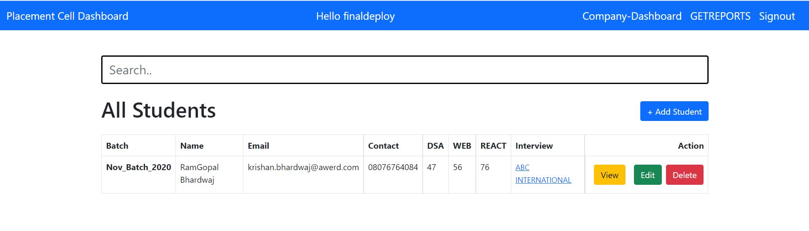
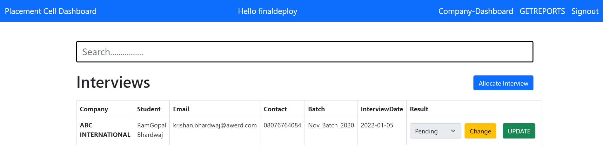

# PlacementCell
<h2>Requirements</h2>

A company constantly needs to download their data to compile different reports. You need to create an interface for the employees of this company to fill in the data into the database and then download it in CSV format

<h2>Features</h2>
<ul>
<li>Sigin/Signup</li>
<li>Keep a track of student progress on the basis of courses score and company's interview through student dashbaord with CRUD support</li>
<li>Company Dashbaord for showing all ongoing interview with arrange an interview with company </li>
<li>Update a result of interview from company dashbaord which reflect in student profile too.</li>
<li>Generate a reports by clicking on GETREPORTS</li>
</ul>
<h2>Screenshots</h2>
<ul>
<li>SIGIN</li>
<li>SIGINUP</li>
<li>STUDENT DASHBAORD</li>
<li>COMPANY DASHBAORD</li>
</ul>

### Technologies Stack: ######
<ul>
  <li><a href="https://code.visualstudio.com/">Vs Code </a>- awesome web-based text editor </li>
  <li><a href="https://nodejs.org/en//">node.js </a>- evented I/O for the backend </li>
  <li><a href="https://expressjs.com/">Express </a>- fast web framework for node.js </li>
  <li><a href="https://www.mongodb.com/">mongoDB </a>- the database for modern applications </li>
  <li><a href="http://www.passportjs.org/">Passport </a>- For Authentication purpose </li>
  <li>etc </li>
</ul>

### Modules Used: ######

    "connect-mongo": "^4.6.0" 
    "cookie-parser": "^1.4.5" 
    "ejs": "^3.1.6" 
    "express": "^4.17.1" 
    "express-session": "^1.17.2" 
    "mongoose": "^6.0.7" 
    "passport": "^0.4.1" 
    "passport-local": "^1.0.0"
 
 ### How to Install : ######
 
Clone the project onto your local machine.

Run 'npm install' to install required dependencies.

Create .env file on root directory and set given below two variable with own values:
  
  SCERET_KEY = <YOUR_SECRET_KEY>
  
  MONGODB_URI= <MONGODB_URL>

Run 'npm start' to start the application.

Visit the application at http://localhost:8990
